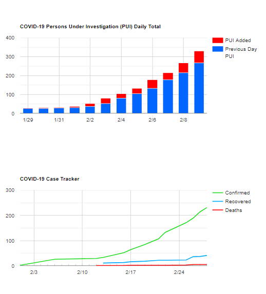

# Data Visualization App using [Next.JS](https://nextjs.org/)

This project is an exercise in my study of NextJS and ReactJS. 

## Objective

The main objective is to use GoogleDoc as data source for visualization. 
I will be using [react-google-charts](https://react-google-charts.com/) module to render the charts/tables.

## Description

**The data is just dummy.**  
The data view is based on COVID-19 outbreak trackers. 
Currently, there are three charts: 

* Stacked-Bar chart that shows PUI daily total.

* Line chart that tracks the number of cases.

* Table chart that list the PUI data for different regions.

## Available Scripts

In the project directory, you can run:

### `npm install`

To install the required modules.

### `npm run dev`

Runs the app in the development mode. 
Open [http://localhost:3000](http://localhost:3000) to view it in the browser.

The page will reload if you make edits. 
You will also see any lint errors in the console.

## Todo

Add map visualization using Google Map. 
